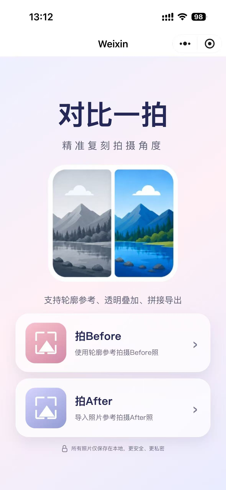
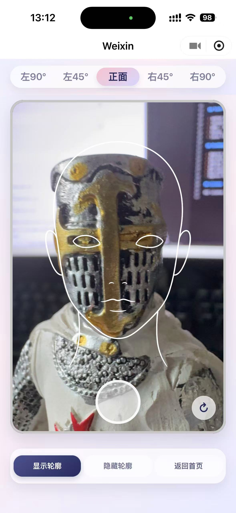
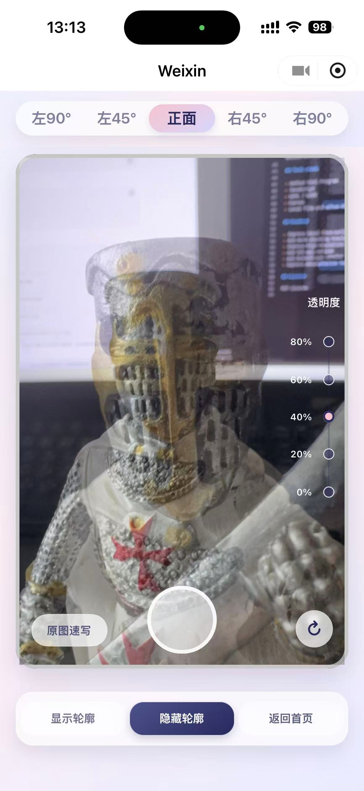
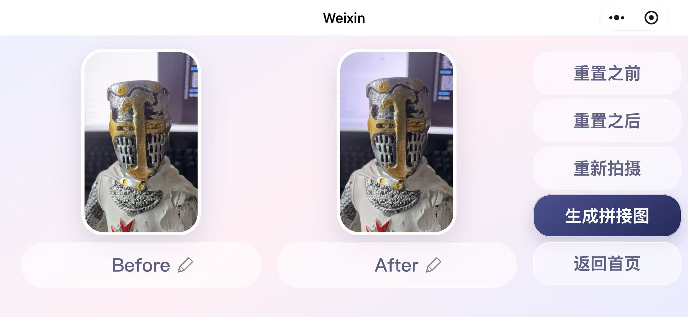
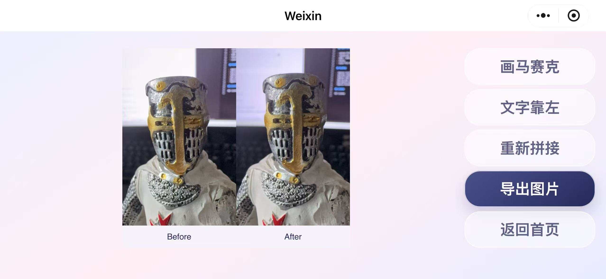
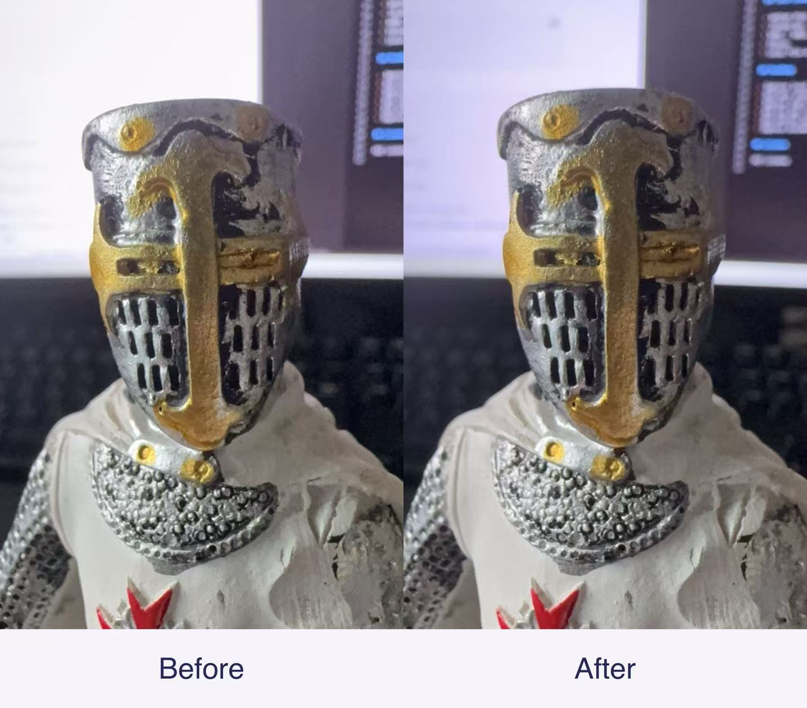

# 对比一拍 / PosePair MiniProgram

Privacy-first before/after comparison photography tool for WeChat Mini Program.

## What is this?

对比一拍是一款面向美业和视觉记录场景的前后对比拍摄辅助工具，适用于医美、美容、美甲、美发、健身、皮肤护理等需要标准化 Before / After 对比图的场景。

It helps practitioners capture more consistent before/after photos using local-only alignment tools.

## Why this matters

Many frontline beauty-service practitioners need consistent before/after photos, but existing tools are often too complex, too expensive, or not designed for their daily workflow.

This project provides a free, no-server, privacy-first solution that runs inside WeChat Mini Program.

## Features

- Before / After shooting workflow
- Default angle guide overlays
- Imported Before photo overlay with adjustable opacity
- Before photo outline sketch reference
- Local image stitching
- Save After photo and comparison image to album
- No server required
- All photos and processing stay on device

## Three alignment methods

1. Default guide overlays  
   Predefined angle guide images help users frame the subject.

2. Before photo opacity overlay  
   Imported Before photo is displayed as a transparent overlay during After shooting.

3. Before photo outline sketch  
   The app can extract or generate a simplified outline reference from the Before photo for easier pose matching.

## Privacy

This project is designed to be local-first. Photos are processed on device and are not uploaded to a server.

## Tech stack

- WeChat Mini Program
- JavaScript
- WXML / WXSS
- Canvas
- Local file and album APIs

## Screenshots

### Home

### Before shooting

### After shooting

### Stitch editor

### Before export

### Result

## Roadmap

### Short-term

- Improve README and developer setup guide
- Polish WeChat Mini Program UI
- Improve local image stitching quality
- Add more angle guide templates
- Improve Before outline extraction
- Improve package structure for open-source reuse

### Mid-term

- Add local face-outline detection where supported
- Improve export resolution
- Add more use-case templates for medical aesthetics, nail care, skincare, hair salons, beauty salons, and fitness
- Add better error handling and permission guidance
- Prepare English documentation for international developers

### Long-term

- Build a free iOS version
- Build a free Android version
- Add English UI support for iOS and Android apps
- Release the iOS version on international App Stores, including the U.S. App Store
- Explore Android distribution for international users
- Add optional local AI-assisted outline tools
- Support more localized templates for beauty-service workflows in different countries and regions

## License

MIT License